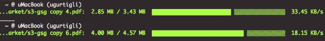

The [Amazon Web Servics S3 Buckets](https://aws.amazon.com/s3/) is an established service which offers reliable, fast and cheap storage, however some projects do not have access to the AWS Cloud or just simply require more autonomy and higher data transfer speeds than otherwise available from AWS. The S3 API is well understood and several S3 API implementations are becoming available from cloud vendors, as well as the open source community for local or on premises deployments. [Mino.io](https://minio.io) is one such prominent component we will be showcasing its deployment as a Pod to ADX, demonstrating ADX's ability to emulate AWS Services while keeping them secure and under your projects control.

# Minio Installation

TBD

# Minio Client Access

The Minio.io Application also has its own CLI for access just like AWS. Alternatively you can also use the AWS S3 CLI and configure it to use your Minio.io Applicatin instead of AWS Services, since the Minio.io API is compatible with AWS S3 API. Follow directions below to install and confgure the Minio.io CLI and browse the content of Minio.io Pod and it's your buckets.

1. Install Minio Client

	```bash
	sudo mkdir -p /minio/bin
	curl https://dl.minio.io/client/mc/release/linux-amd64/mc > /minio/bin/mc
	sudo chmod +x mc
	``

1. Test Client Install

	```bash
	/minio/bin/mc --help
	```

	Should return the help content of the tool


1. Configure Minio Client

	```
	/minio/bin/mc config host add minio https://<<Route to your Minio.io Application>> <<your access key>> <<your secret key>> --insecure
	```

1. List all Minio.io Buckets recursively

	```bash
	/minio/bin/mc ls minio --insecure -r
	```

1. Copy file from Minio Bucket

	```bash
	/minio/bin/mc cp minio/<<your bucket>>/<<your file>> /tmp/<<your file>> --insecure
	```

	As files are processed the CLI dispays a progress bar as seen below

	

# References

* Minio.io Documentation https://docs.minio.io/docs/minio-client-complete-guide 
