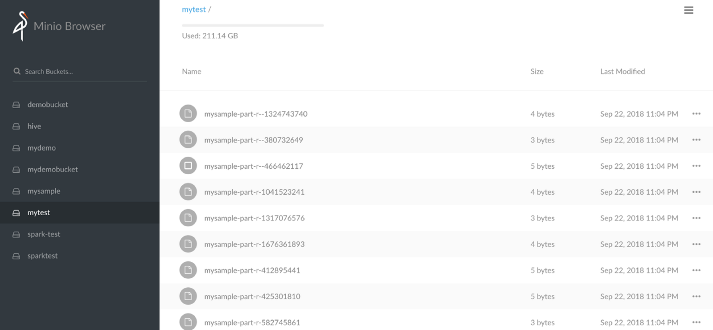

The [Amazon Web Servics S3 Buckets](https://aws.amazon.com/s3/) is an established service which offers reliable, fast and cheap storage, however some projects do not have access to the AWS Cloud or just simply require more autonomy and higher data transfer speeds than otherwise available from AWS. The S3 API is well understood and several S3 API implementations are becoming available from cloud vendors, as well as the open source community for local or on premises deployments. [Mino.io](https://minio.io) is one such prominent component we will be showcasing its deployment as a Pod to OKD, demonstrating OKD's ability to emulate AWS Services while keeping them secure and under your projects control.

# Prerequisites

* OKD Cluster Admin Access

# Minio Installation

>NOTE: In this installation we are creating a namespace named `metis` where we will be deploying & confiuring the Minio Pod

1. Login as Cluster Admin

    ```
    oc login -u system:admin
    ```

1. Create Namespace

	```
	oc new-project metis --description="metis" --display-name="metis"
	```

1. Clone Project

	```
	git clone git@github.com:advlab/metis.git
	cd metis
	```

1. Create Service Account

	```
	oc create serviceaccount metis
	```

1. Grant rights to service account

	```
	oc adm policy add-scc-to-user anyuid -z metis -n metis
	```

1. Grants User Access to Project

	```
	oc adm policy add-role-to-user admin YOUR_USER_ID -n metis
	```

1. Create Git Key

	```
	ssh-keygen -t rsa -b 4096 -C "metis@noreply.com" -f $HOME/.ssh/metis
	```

1. Configure GitHub Project Deploy Key using the Git Key from above

1. Create GitHub Secret

	```
	oc create secret generic github-metis --type=kubernetes.io/ssh-auth --from-file=ssh-privatekey=$HOME/.ssh/metis
	```

1. Annotate Secret

	```
	oc annotate secret/github-metis 'build.openshift.io/source-secret-match-uri-1=git@github.com/advlab/metis.git'
	```

1. Create Image Stream

	```
	oc create -f minio/build-minio-imagestream.yml
	```

1. Build Image

	```
	oc create -f minio/build-minio-image.yml
	oc start-build build-minio-image --follow
	```

1. Deploy Pod

	>NOTE: The Minio Access Key and Secret Key can be any arbitrary strings (e.g. `changeit`). Safeguard these keys for client access.

	```
	oc new-app -f minio/deploy-minio.yml -p POD_NAME=minio -p MINIO_ACCESS_KEY=YOUR_KEY -p MINIO_SECRET_KEY=YOUR_SECRET -p MINIO_VOLUME_CAPACITY=100Gi
	```

1. Browse Route to test Minio Application

	(e.g. https://minio-metis.openshift.sytes.net)

	At this point you are ready to create Buckets and load data 

# Teardown

1. To delete the Pod (e.g. *minio*) and related resources use:

    >NOTE: Use Caution

    ```
	oc delete all -l app=minio
	oc delete pvc -l app=minio
	oc delete is minio
	oc delete bc/build-minio-image
    ```

# Minio Client Access

The Minio.io Application also has its own CLI for access just like AWS. Alternatively you can also use the AWS S3 CLI and configure it to use your Minio.io Applicatin instead of AWS Services, since the Minio.io API is compatible with AWS S3 API. Follow directions below to install and confgure the Minio.io CLI and browse the content of Minio.io Pod and it's your buckets.

1. Install Minio Client

	```bash
	sudo mkdir -p /minio/bin
	curl https://dl.minio.io/client/mc/release/linux-amd64/mc > /minio/bin/mc
	sudo chmod +x mc
	``

1. Test Client Install

	```bash
	/minio/bin/mc --help
	```

	Should return the help content of the tool

1. Configure Minio Client

	```
	/minio/bin/mc config host add minio https://<<Route to your Minio.io Application>> <<your access key>> <<your secret key>> --insecure
	```

1. List all Minio.io Buckets recursively

	```bash
	/minio/bin/mc ls minio --insecure -r
	```

1. Copy file from Minio Bucket

	```bash
	/minio/bin/mc cp minio/<<your bucket>>/<<your file>> /tmp/<<your file>> --insecure
	```

	As files are processed the CLI dispays a progress bar as seen below

	

# References

* Minio.io Documentation https://docs.minio.io/docs/minio-client-complete-guide 
